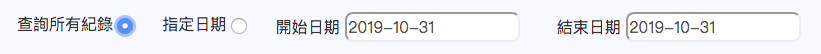

# 如何disable &lt;input&gt;元件？

如何disable input元件？

```javascript
$("input").prop('disabled', true);
$("input").prop('disabled', false);
```

## Ref.

[Disable/enable an input with jQuery?](https://stackoverflow.com/questions/1414365/disable-enable-an-input-with-jquery)

## 範例



```markup

...
        <div class="row">
            <div class="col-auto"> 查詢所有紀錄 
                <input type="radio" name="searchRecord" value="all" checked="checked">  
            </div>
            <div class="col-auto"> 指定日期
                <input type="radio" name="searchRecord" value="assign">
            </div>
            <div class="col-3">
                開始日期 <input type="text" id="startDate" class="datepicker">
            </div>
            <div class="col-3">
                結束日期 <input type="text" id="endDate" class="datepicker">
            </div>
        </div>
...
```



建立監聽事件：當選擇其中一個`radio`選項，就會觸發做事情。如：當選擇「**查詢所有紀錄**」，就會將日期的畫面`disabled`；反之，若選擇「**指定日期**」，就不會將日期的畫面`disabled`，讓user可以選擇日期。

第二行`input[type=radio][name=searchRecord]:checked`用來判斷現在是哪個選項被點擊

```javascript
$("input[type=radio][name=searchRecord]").on('click', function(event) {
    if ($("input[type=radio][name=searchRecord]:checked").val() == "all") {
        $("#startDate, #endDate").prop('disabled', true);
    } else {
        $("#startDate, #endDate").prop('disabled', false);
    }
});
```

### 顯示畫面：




### 另外：如何在一開啟畫面就去執行監聽事件的動作

使用`trigger`

```javascript
$(ELEMENT_A).on('click', function(){
    console.log("ELEMENT_A do something!")
})

testFunc: function() {
    $(ELEMENT_A).trigger("click");
}
```

在此範例加入以下這行：

```javascript
$("input[type=radio][name=searchRecord]:checked").trigger('click');
```

