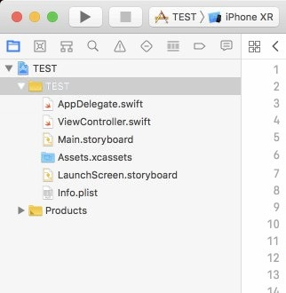

# App Life Cycle 應用程式生命週期

App永遠都會是下面五種狀態的其中一種：

1. **Not Running**: App尚未啟動之前都會是這個狀態
2. **Inactive**: 使用者啟動App後，到進入可以操作完整畫面之前的狀態，通常會在這個時期做一些設定
3. **Active**: 也稱之**foreground** **App**，進到畫面中App的狀態，UI開始運作、可以開始接收與回傳事件。這個時候的狀態，可以存取系統資源
4. **Background**: 關掉App或切換到使用另一個App時的狀態，這個時候的狀態就會限制存取系統的資源
5. **Suspend**: 進入**Background**狀態一段時間若未回到Active狀態，則會進入此狀態。經過一段時間系統也有權可以把狀態移至**Not Runnung**



試建立一個XCODE專案，對照左側欄位的每個檔案及流程

