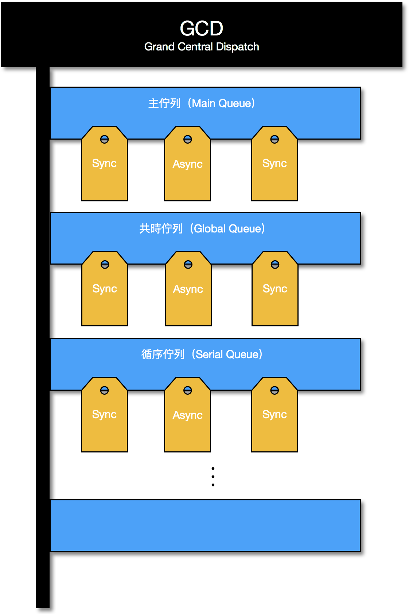
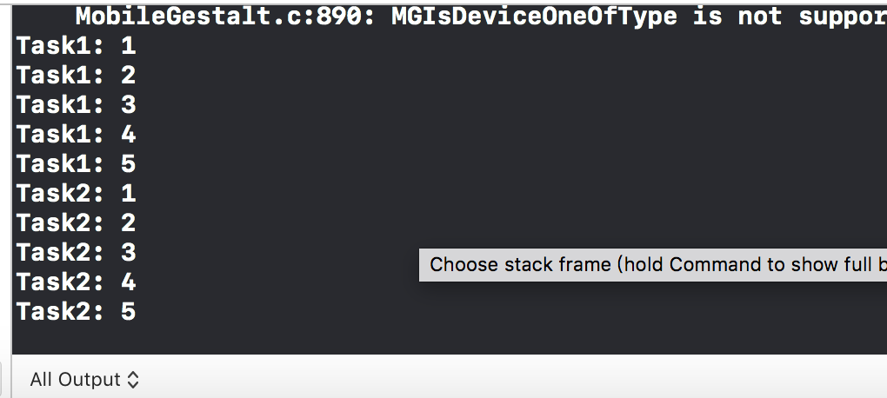
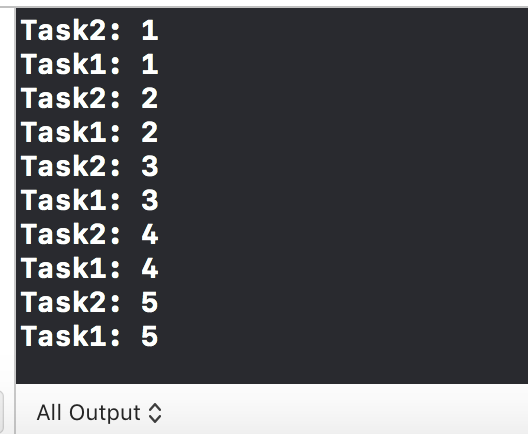
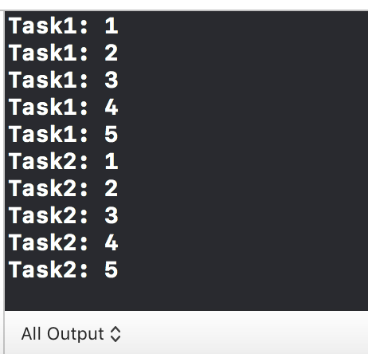

# GCD


GCD（Grand Central Dispatch）？

同時執行多項任務，並分配任務給多顆核心分別去執行。即『多工』。  
可看成三類的生產線：主佇列、共時佇列、循序佇列。




* 主佇列Main Queue
  * 每個程式只有**一個**主佇列
  * 程式預設的工作都在主佇列執行
  * 跟**畫面更新**有關的工作都在主佇列執行
  * 只能放**非同步\(Async\)**的任務，**不能**放**同步\(Sync\)**的任務，否則畫面會卡住。
* 共時佇列Concurrent Queue、Global Queue
  * 有多個共時佇列
  * 跟畫面無關的工作都可以在共時佇列執行
  * 想要同時做很多工作的時候
  * 下載大量資料的時候
* 
任務分為兩種，主要描述函數回傳資料的行為：

* **同步 \(Synchronously\)** 一執行函式，等完全做完事情才會跳出函式，再接續做接下來要處理的事
* **非同步 \(Asynchronously\)** 一執行函式，當要執行某函式\(工作\)時，就會跳離到該函式並且執行，然後繼續回到原本的函式做接續的工作

```swift
    let task1 = {
        for i in 1...5{
            print("Task1: \(i)")
        }
    }
        
    let task2 = {
        for i in 1...5{
            print("Task2: \(i)")
        }
    }  
```

#### 使用「主佇列」，執行「非同步」工作：

```swift
    DispatchQueue.main.async(execute: task1)
    DispatchQueue.main.async(execute: task2)
```




主佇列執行非同步工作，其執行結果會是按工作的順序執行。

相較在共時佇列執行非同步工作的結果會是不一樣的。


#### 使用「共時佇列」，執行「非同步」工作：

```swift
    DispatchQueue.global().async(execute: task1)
    DispatchQueue.global().async(execute: task2)
```



#### 使用「共時佇列」，執行「同步」工作：

```swift
    DispatchQueue.global().sync(execute: task1)
    DispatchQueue.global().sync(execute: task2)
```



### 其他文章參考

{% embed url="https://medium.com/@mikru168/ios-gcd%E5%A4%9A%E5%9F%B7%E8%A1%8C%E7%B7%92%E7%9A%84%E8%AA%AA%E6%98%8E%E8%88%87%E6%87%89%E7%94%A8-c69a68d01da1" %}

[https://www.appcoda.com.tw/grand-central-dispatch/](https://www.appcoda.com.tw/grand-central-dispatch/)


