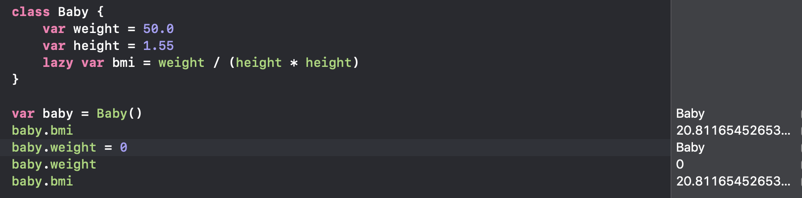

# lazy的儲存屬性

* let 宣告的屬性不能加上 lazy
* computed property 不能加上 lazy
* lazy 的屬性一定要在宣告時指定初始值
* lazy 只會執行一次  

  

請參考：

{% embed url="https://medium.com/%E5%BD%BC%E5%BE%97%E6%BD%98%E7%9A%84-swift-ios-app-%E9%96%8B%E7%99%BC%E5%95%8F%E9%A1%8C%E8%A7%A3%E7%AD%94%E9%9B%86/%E8%AE%93%E5%B1%AC%E6%80%A7%E8%AE%8A%E6%87%B6%E7%9A%84-swift-lazy-%E5%92%92%E8%AA%9E-cfcc16840bd2" %}

