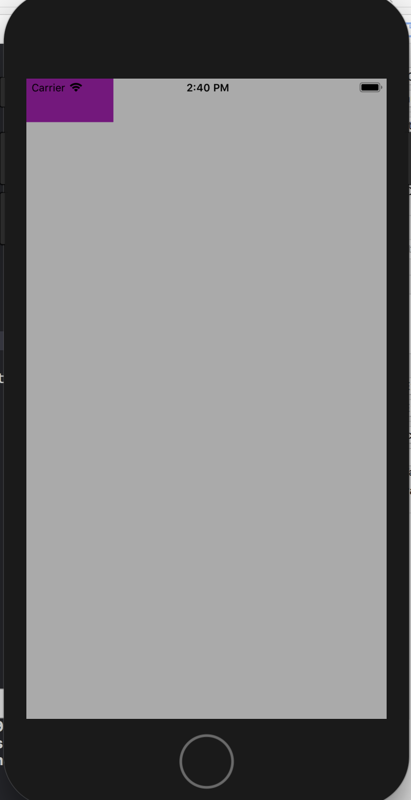

# UIView


`UIView`？

畫面上一個四方形的區域，整個畫面也是一個UIView


用程式碼加入UIView顯示於畫面上



```swift
self.view.backgroundColor = UIColor.lightGray

let viewArea = CGRect(x: 0, y: 0, width: 100, height: 50)
let smallRect = UIView(frame: viewArea)
smallRect.backgroundColor = UIColor.purple
view.addSubview(smallRect)
```


