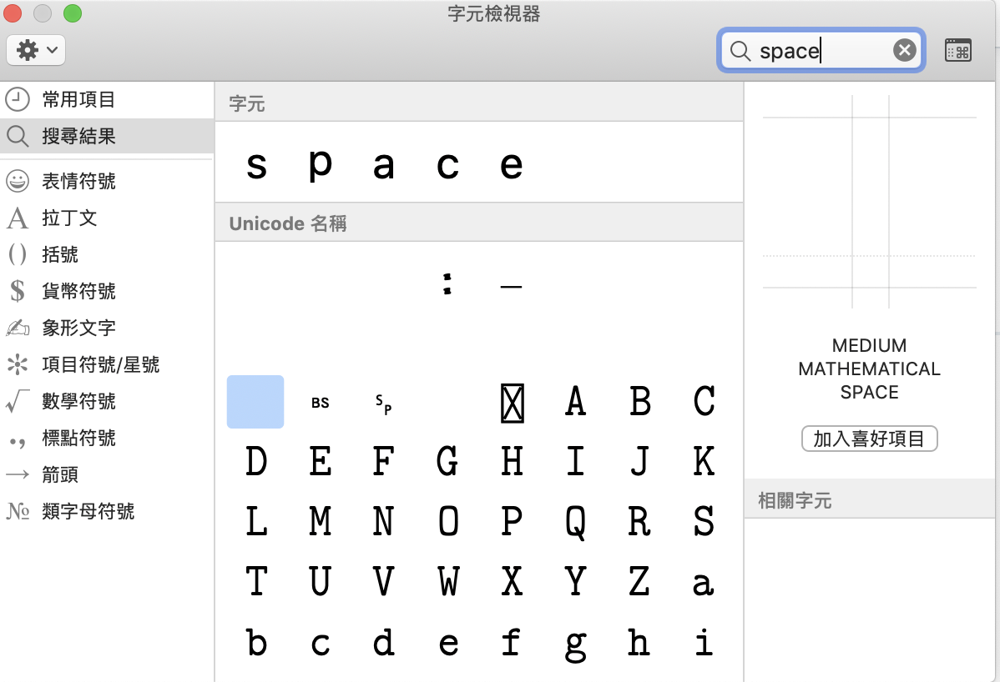

# mac: FB發文如何「空格」及「換行」

也許還有其他方法, 但我的作法如下:

### 空格

1. `Ctrl` + `Cmd` + `Space`
2. 右上角搜尋**space**
3. 點兩下選擇 `MEDIUM MATHEMATICAL SPACE` 即可產生空白

### 換行

1. `Shift` + `Enter`即可產生換行\(有一點點明顯的換行\)
2. 若要空更多行: 在這裡插入一個空格\(同上述**空格**的步驟\)
3. `Shift` + `Enter`即可再產生一個換行

