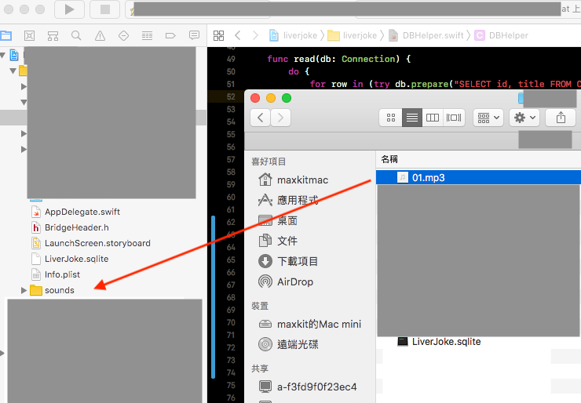

# SQLite.swift遇到No such table code : 1

把`db`拖曳至XCode專案裡，然後存取該db，因此要使用`Bundle.main.url(forResource:"`**`FILENAME`**`", withExtension: "`**`FILEFORMAT`**`")`，而不是使用`try! FileManager.default.url(for: .documentDirectory, in: .userDomainMask, appropriateFor: nil, create: false).appendingPathComponent("`**`FILENAME.FILEFORMAT`**`")`

\`\`

會造成讀不到檔，是因為將`db`拖曳至XCode的行為和拖曳其他檔\(`mp3`\)的行為有落差，這會導致讀到`nil`，參考以下範例，改掉就可以了

