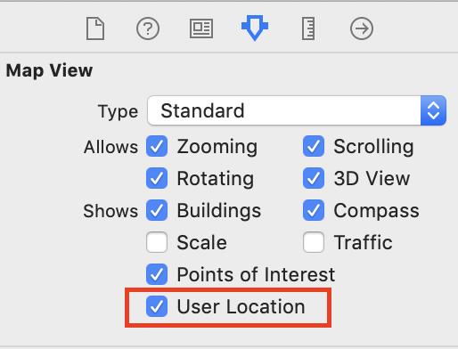
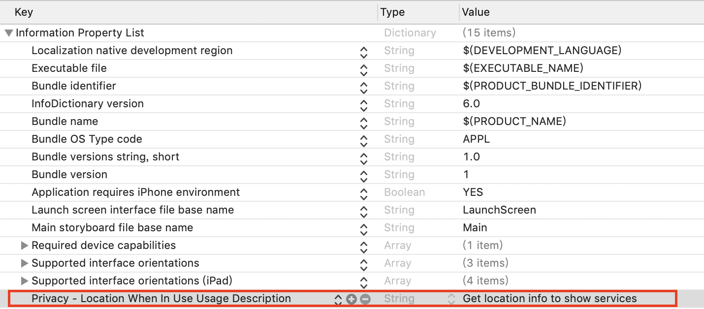
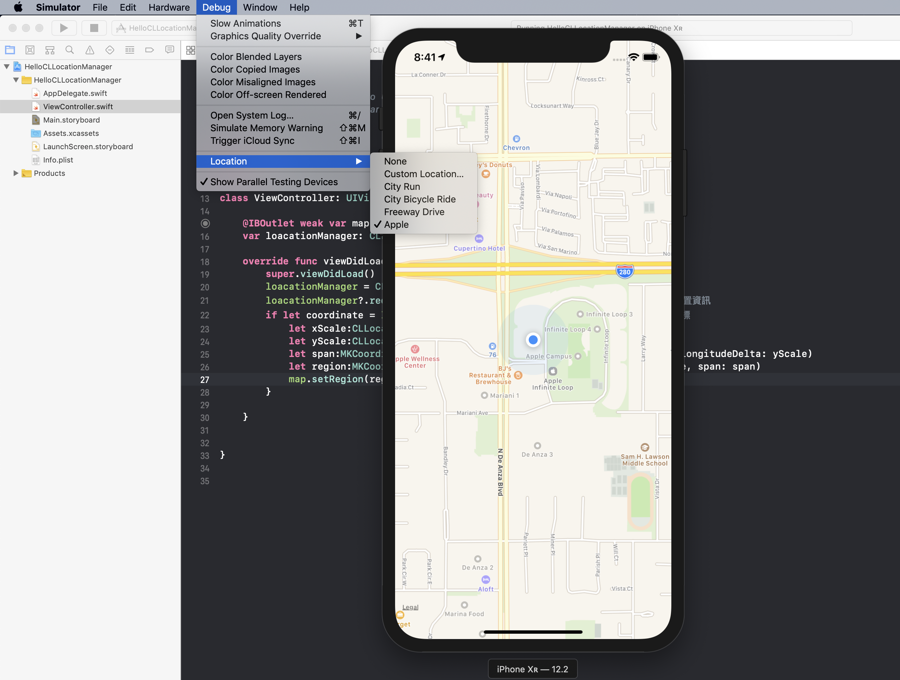

# Map 地圖呈現使用者位置

1. 需要使用**Map Kit View** Library
2. 匯入函式庫`import MapKit` 
3. 匯入函式庫`import CoreLocation // 為了取得使用者位置`
4.  勾選

   

5. 取得使用者位置必須取得隱私權受權，plist檔加入  

   

6. 執行測試時可用內建模擬方法  

   


## 範例



```swift
    @IBOutlet weak var map: MKMapView!
    var loacationManager: CLLocationManager?
    
    override func viewDidLoad() {
        super.viewDidLoad()
        loacationManager = CLLocationManager()
        loacationManager?.requestWhenInUseAuthorization() // 請求使用者授權取得手機位置資訊
        if let coordinate = loacationManager?.location?.coordinate { // 取得目前座標
            let xScale:CLLocationDegrees = 0.01
            let yScale:CLLocationDegrees = 0.01
            let span:MKCoordinateSpan = MKCoordinateSpan(latitudeDelta: xScale, longitudeDelta: yScale)
            let region:MKCoordinateRegion = MKCoordinateRegion(center: coordinate, span: span)
            map.setRegion(region, animated: true)
        }

    }
```



