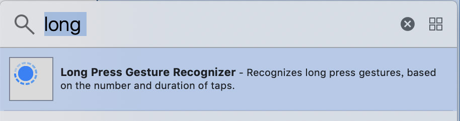

# Map 地圖簡易呈現

## 顯示地圖

1. 需要使用**Map Kit View** Library
2. 匯入函式庫`import MapKit` 

## 其他顯示項目

取得手指長按的位置與座標



## 顯示特定區域

|  |  |  |
| :--- | :--- | :--- |


<table>
  <thead>
    <tr>
      <th style="text-align:left">
        <p>&#x7DEF;&#x5EA6;&#xFF1A;<code>CLLocationDegrees</code>
        </p>
        <p>&#x7D93;&#x5EA6;&#xFF1A;<code>CLLocationDegrees</code>
        </p>
      </th>
      <th style="text-align:left">&#x2794;</th>
      <th style="text-align:left">&#x5EA7;&#x6A19;&#xFF1A;<code>CLLocationCoordinate2D</code>
      </th>
    </tr>
  </thead>
  <tbody></tbody>
</table>

<table>
  <thead>
    <tr>
      <th style="text-align:left">
        <p>&#x6A6B;&#x5411;&#x7E2E;&#x653E;&#xFF1A;<code>CLLocationDegrees</code>
        </p>
        <p>&#x7E31;&#x5411;&#x7E2E;&#x653E;&#xFF1A;<code>CLLocationDegrees</code>
        </p>
      </th>
      <th style="text-align:left">&#x2794;</th>
      <th style="text-align:left">&#x7E2E;&#x653E;&#x7BC4;&#x570D;&#xFF1A;<code>MKCoordinateSpan</code>
      </th>
    </tr>
  </thead>
  <tbody></tbody>
</table>

| 座標：`CLLocationCoordinate2D` 縮放範圍：`MKCoordinateSpan` | ➔ | 整體顯示範圍：`MKCoordinateRegion` |
| :--- | :--- | :--- |




```swift
import UIKit
import MapKit

class ViewController: UIViewController {

    @IBOutlet weak var map: MKMapView!
    @IBAction func addMeAnnotation(_ sender: UILongPressGestureRecognizer) {
        let touchPoint = sender.location(in: map) // 手指觸碰到地圖上面的位置
        let touchCoordinate:CLLocationCoordinate2D = map.convert(touchPoint, toCoordinateFrom: map) // 將觸碰的點轉換成地圖上的座標
        let annotation = MKPointAnnotation()
        annotation.coordinate = touchCoordinate
        map.addAnnotation(annotation)
    }

    override func viewDidLoad() {
        super.viewDidLoad()
        let latitude: CLLocationDegrees      = 25.034275
        let longitude: CLLocationDegrees     = 121.564494
        let location: CLLocationCoordinate2D = CLLocationCoordinate2D(latitude: latitude, longitude: longitude)

        let xScale: CLLocationDegrees = 0.01 // 0.0 <= scale <= 1.0
        let yScale:    CLLocationDegrees = 0.01
        let span:    MKCoordinateSpan  = MKCoordinateSpan(latitudeDelta: yScale, longitudeDelta: xScale)

        let region:    MKCoordinateRegion = MKCoordinateRegion(center: location, span: span)

        // 讓地圖顯示特定區域 
        map.setRegion(region, animated: true)

        // 地圖顯示模式
        map.mapType = .mutedStandard

        // 加入大頭針
        let annotation = MKPointAnnotation()
        annotation.coordinate = location
        annotation.title = "艾非爾鐵塔"
        annotation.subtitle = "我曾經去過那裡"
        map.addAnnotation(annotatio)
    }
}
```



