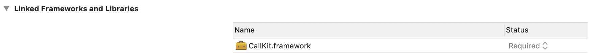
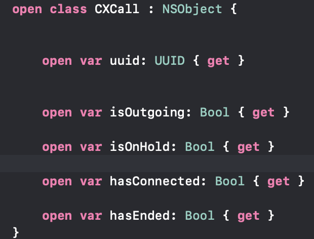

# 取得打電話的狀態

要取得打電話的狀態來做一些事情的話，可以參考以下步驟：

* 加入framework：
* `import CallKit`
* 服從`CXCallObserverDelegate`協定
* 實作`func callObserver(_ callObserver: CXCallObserver, callChanged call: CXCall)` `call`型態為`CXCall，`表示打電話的狀態，有下列幾種：  
* 設定`delegate`給需要使用的file，寫法如下：

  `let callObser = CXCallObserver()`  
  `callObser.setDelegate(self, queue: nil)`

