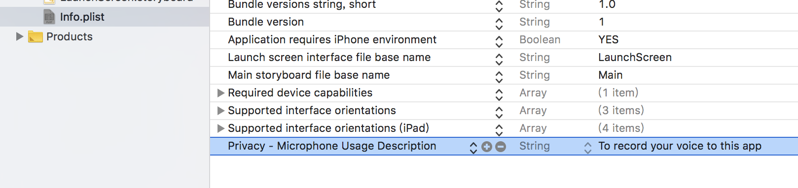

# Record 錄音功能


錄音功能需要使用到`AVAudioRecorder`類別


1. 建立專案
2. 建立錄音檔存放路徑
3. 設定錄音的一些參數（比如錄音的品質）
4. 產生`AVAudioRecorder()`
5. 設定錄音的工作模式（啟動錄音、停止錄音）及音訊工作階段模式（錄音與播放都有各自的模式要設定）`let session = AVAudioSession.sharedInstance()`
6. 若要設定錄音完的後續工作（比如播放錄音、停止播放錄音），必須遵從`AVAudioRecorderDelegate`的協定
   1. `ViewController`當作`audioRecorder?.delegate`的屬性來做後續的處理`audioRecorder?.delegate = self`，`self`代表`ViewController`。
   2. 以此例（後續要做播放錄音、停止播放錄音）須實作`AVAudioRecorderDelegate`其中一個函式`func audioRecorderDidFinishRecording(_ recorder: AVAudioRecorder, successfully flag: Bool)`
7. 錄音需要使用者同意，須打開手機使用麥克風的權限，Info.plist檔新增Privacy - Microphone Usage Description  

   



```swift
import UIKit
import AVFoundation

enum AudioSessionMode{
    case record
    case play
}

class ViewController: UIViewController, AVAudioRecorderDelegate {

    var audioRecorder:AVAudioRecorder?
    var audioPlayer:AVAudioPlayer?
    var isRecording = false
    
    // 錄音
    @IBAction func recordAudio(_ sender: UIButton) {
        settingAudioSession(toMode: .record)
        audioRecorder?.prepareToRecord()
        audioRecorder?.record()
        isRecording = true
    }
    
    // 停止錄音
    @IBAction func stopRecording(_ sender: UIButton) {
        if audioRecorder != nil{
            audioRecorder?.stop()
            isRecording = false
            settingAudioSession(toMode: .play)
        }
    }
    
    // 播放錄音
    @IBAction func playRecordedSound(_ sender: UIButton) {
        if isRecording == false{
            audioPlayer?.stop()
            audioPlayer?.currentTime = 0.0
            audioPlayer?.play()
        }
    }
    
    // 停止播放錄音
    @IBAction func stopPlaying(_ sender: UIButton) {
        if isRecording == false{
            audioPlayer?.stop()
            audioPlayer?.currentTime = 0.0
        }
    }
    
    // 設定音訊工作階段模式
    func settingAudioSession(toMode mode:AudioSessionMode){
        
        // 設定音訊工作階段之前，必須先停止audioPlayer的運作，避免實機執行的時候發生意外錯誤
        audioPlayer?.stop() 
        
        let session = AVAudioSession.sharedInstance()
        do{
            switch mode {
            case .record:
                try session.setCategory(AVAudioSession.Category.playAndRecord, mode: .default, policy: .default)
            case .play:
                try session.setCategory(AVAudioSession.Category.playback, mode: .default, policy: .default)
            }
            
            // 停用正在運行I/O的語音對話
            try session.setActive(false)
        }catch{
            print(error.localizedDescription)
        }
    }
    
    // 實作AVAudioRecorderDelegate協定的函式audioRecorderDidFinishRecording
    func audioRecorderDidFinishRecording(_ recorder: AVAudioRecorder, successfully flag: Bool) {
        if flag == true{
            do{
                audioPlayer = try AVAudioPlayer(contentsOf: recorder.url)
            }catch{
                print(error.localizedDescription)
            }
        }
    }
    
    override func viewDidLoad() {
    
        super.viewDidLoad()
        
        // 建立錄音檔存放路徑
        let fileName = "User.wav"
        let path = NSHomeDirectory() + "/Documents/" + fileName
        let url = URL(fileURLWithPath: path)
        
        // 設定錄音的參數
        let recordSettings:[String:Any] = [
            AVEncoderAudioQualityKey: AVAudioQuality.min.rawValue,
            AVEncoderBitRateKey: 16,
            AVNumberOfChannelsKey: 2,
            AVSampleRateKey: 44100.0
        ]
        do{
            audioRecorder = try AVAudioRecorder(url: url, settings: recordSettings)
            audioRecorder?.delegate = self
        }catch{
            print(error.localizedDescription)
        }
    }
}
```



## 模組化注意事項


`audioRecorder?.delegate = self`  
之後若想用一個類別將目前範例的功能包起來的話，那`self`就代表這個新增的類別，因為要這個類別來處理錄音後的相關事宜。但目前以該範例來說代表的為`ViewController`。



要服從某項協定的話，必須是`NSObject`的子類別。因此新增的類別若要遵從`AVAudioRecorderDelegate`協定的話，寫法如下：


```swift
class RecordHelper:NSObject, AVAudioRecorderDelegate{
    ...
}
```


因為是`NSObject`的子類別，所以必須`override init`的方法，並記得加上`super.init()`。如下：


```swift
class RecordHelper:NSObject, AVAudioRecorderDelegate{
    ...
    override init() {
        super.init()
        ...
   }
}
```

