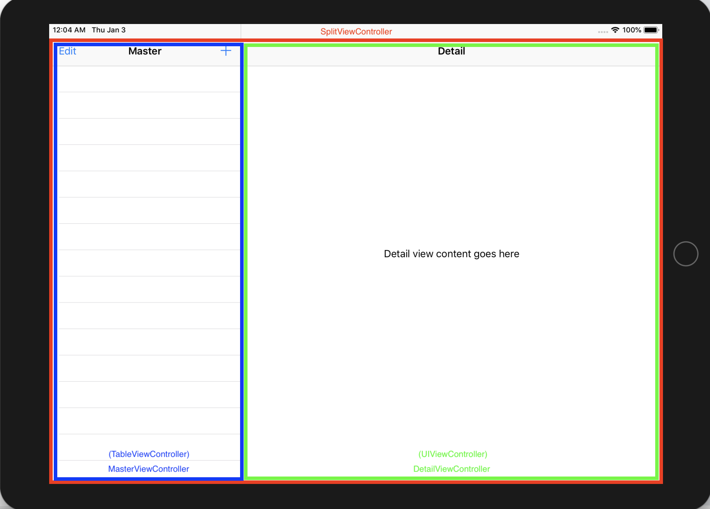
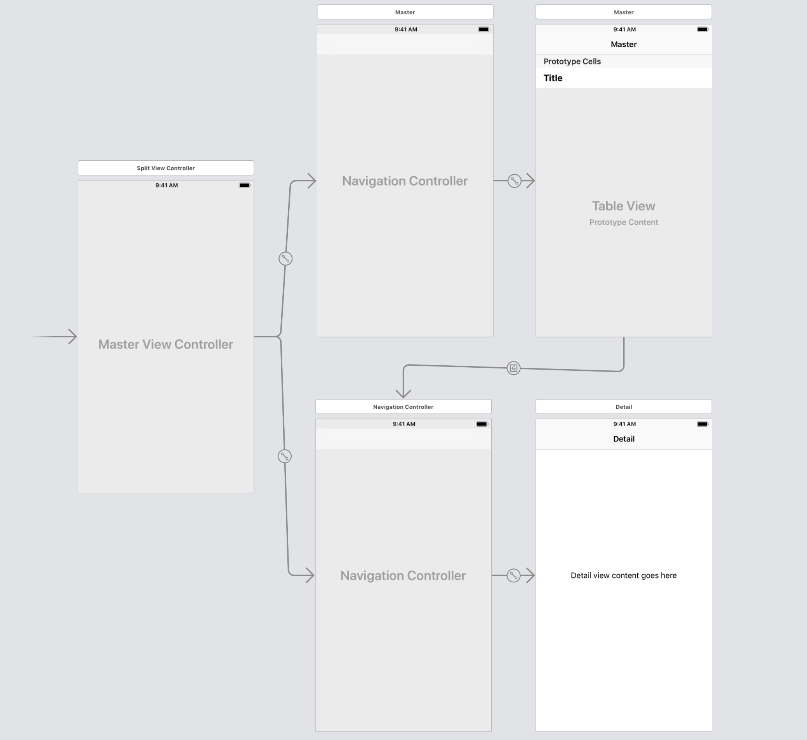
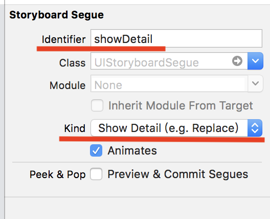

# SplitViewController簡述

建立新專案，選擇**Master-Detail App**

1. MasterViewController是一個**TableViewController**
2. DetailViewController是一個**UIViewController**
3. MasterViewController與DetailViewController都包在**NavigationController**裡面，這兩個NavigationController包在**SplitViewController**裡面
4. MasterViewController -&gt; DetailViewController存在segue，注意其id及kind  

