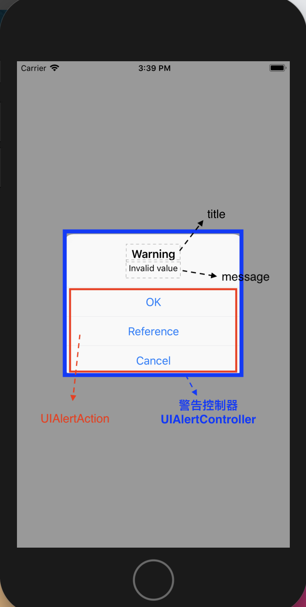

# UIAlertController 警告控制器



```swift
...
    @IBAction func showAlert(_ sender: UIButton) {
        let myAlert = UIAlertController(title: "Warning", message: "Invalid value", preferredStyle: .alert)
        
        let okAction = UIAlertAction(title: "OK", style: .default)
        
        let referenceAction = UIAlertAction(title: "Reference", style: .default) {
            (action:UIAlertAction) in
            // 讓警告控制器消失
            self.dismiss(animated: true, completion: nil)
        }
        
        let cancelAction = UIAlertAction(title: "Cancel", style: .default) {
            (action:UIAlertAction) in
            // 讓警告控制器消失
            self.dismiss(animated: true, completion: nil)
        }
        
        // 將按鈕掛進警告控制器裡
        myAlert.addAction(okAction)
        myAlert.addAction(referenceAction)
        myAlert.addAction(cancelAction)
        
        // 呈現
        present(myAlert, animated: true, completion: nil)
    }
...
```

