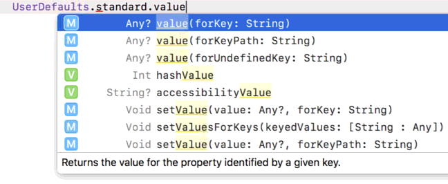

# UserDefaults 存資料至手機

使用簡單的`UserDefaults()`來存放資料到手機。

其中`set`提供多種**存放**資料的格式：


`value`提供**讀取**的格式：



## 範例

```swift
//存放字串
UserDefaults.standard.set("Fred Shao", forKey: "name")

//存放陣列
let colorArray = ["red","blue","green"]
UserDefaults.standard.set(fruitArray, forKey: "colors")
```


```swift
//讀取字串
if let loadName = UserDefaults.standard.value(forKey: "name") as? String{
            print(loadName)
}
        
//讀取陣列
if let loadColorArray = UserDefaults.standard.value(forKey: "colors") as? [String]{
        for i in loadColorArray{
                print(i)
        }
}
```


