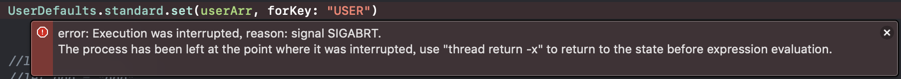

# UserDefaults無法存取客製化的struct

### 一般情況

```swift
let aaa = "aaa"
let bbb = "bbb"
var strArr = [String]()

strArr.append(aaa)
strArr.append(bbb)

UserDefaults.standard.set(strArr, forKey: "STRINFO")

```

### 有問題的情況

```swift
struct UserData {
    var name:String
    var id:String
}

let tom = UserData(name: "Tom", id: "123-0000")
let ivy = UserData(name: "Ivy", id: "123-1111")
var userArr = [UserData]()

userArr.append(tom)
userArr.append(ivy)

UserDefaults.standard.set(userArr, forKey: "USER")
```

會產生以下error  



#### 改善

```swift
// 將自訂結構遵循Codable協定
struct UserData: Codable {
    var name:String
    var id:String
}

let tom = UserData(name: "Tom", id: "123-0000")
let ivy = UserData(name: "Ivy", id: "123-1111")
var userArr = [UserData]()

userArr.append(tom)
userArr.append(ivy)

// 存資料並encode
do {
    UserDefaults.standard.set(try PropertyListEncoder().encode(userArr as! [UserData]), forKey: "USER")
} catch {
    print("something wrong")
}

// 取資料並decode
if let data = UserDefaults.standard.data(forKey: "USER") {
    do {
        print(try PropertyListDecoder().decode([UserData].self, from: data).first?.id)
    } catch {
        print("something wrong")
    }
}


```

