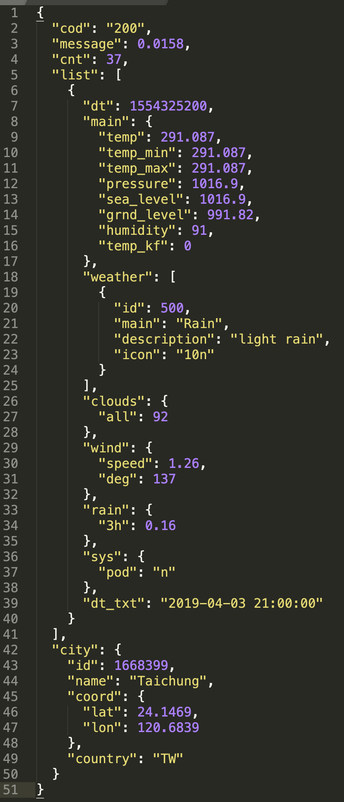

# 解析JSON資料


**JSON**是網路傳送資料的一種格式，通常是**陣列\(Array\)**跟**字典\(Dictionary\)**的組合，差別在於字典是用大括號`{}`包起來，而非中括號`[]`

`[                            ----------------------┐  
    {                        --------┐             |  
        "name":"Alley",              │             |  
        "sex":"female",          Dictionary        │  
        "id:"0001""                  │             │  
    },                       --------┘           Array  
    {                        --------┐             │  
        "name":"Alen",               │             │  
        "sex":"male",            Dictionary        │  
        "id:"0002""                  │             │  
    }                        --------┘             │  
]                            ----------------------┘`


      `Key              Array  
    ┌--┴--┐ ┌------------┴-----------┐  
    │     │ │                        │  
{   │     │ │                        │  
    "fruit":["apple","banana","mango"],  
    "number":["1","2","3"]  
}`



下列網站用來將JSON檔案斷行  
[http://jsonprettyprint.com/](http://jsonprettyprint.com/)


## 舊的解析方法

解析網路上API提供的JSON資料格式：透過`JSONSerialization.jsonObject()`並回傳`Any`型態

```swift
do{
    let json = try JSONSerialization.jsonObject(with: Data, options: JSONSerialization.ReadingOptions)
    DispatchQueue.main.async {
        self.parseJson(json: json)
    }
}catch{
    ...
}
```

得到`json`之後，再轉型成與API所提供資料格式相對應的格式：

### 範例1

參考API範例：[https://randomuser.me/](https://randomuser.me/)  
再與下列程式相比較，只抓取有需要的部分（`name`, `email`, `phone`, `picture`）：

```swift
...
        if let okJson = json as? [String:Any]{
            if let infoArray = okJson["results"] as? [[String:Any]]{
                let infoDictionary = infoArray[0]
                let loadedName = userFullName(nameDictionary: infoDictionary["name"])
                let loadedEmail = infoDictionary["email"] as? String
                let loadedPhone = infoDictionary["phone"] as? String
                let imageDictionary = infoDictionary["picture"] as? [String:String]
                let loadedImageAddress = imageDictionary?["large"]
                let loadedUser = User(name: loadedName, email: loadedEmail, number: loadedPhone, image: loadedImageAddress)
                settingInfo(user: loadedUser)
            }
        }
...
```

### 範例2

參考API範例：[https://openweathermap.org/current](https://openweathermap.org/current)  
要解析的`JSON`資料，此為天氣預報API回傳的資訊如下：



```swift
// 定義欲抓取的資訊
struct User {
    var name:               String?
    var location:           String?
    var email:              String?
    var LoginInfo:          LoginInfo?
    var phone:              String?
    var picture:            String?
}

struct LoginInfo {
    var loginName: String?
    var loginPassword: String?
}

class ViewController: UIViewController {
    let apiAddress = "https://samples.openweathermap.org/data/2.5/weather?id=2172797&appid=6b75d28896008dea29ea1ade66036744"
    var urlSession = URLSession(configuration: .default)

    override func viewDidLoad() {
        super.viewDidLoad()
        downloadInfo(apiAddress)
    }
    
    func downloadInfo(_ webAddress: String) {
        if let url = URL(string: webAddress) {
            let task = urlSession.dataTask(with: url) {
                (data, response, error) in
                if error != nil {
                    let errorCode = (error! as NSError).code
                    if errorCode == -1009 {
                        DispatchQueue.main.async { self.popAlert("No internet") }
                    } else {
                        DispatchQueue.main.async { self.popAlert("Somethings wrong \"\(errorCode)\"") }
                    }
                    return
                }
                if let loadedData = data {
                    print("got data")
                    do {
                        let json:Any = try JSONSerialization.jsonObject(with: loadedData, options: [])
                        DispatchQueue.main.async {
                            self.parseJson(json: json)
                        }
                    } catch {
                        ...
                    }
                }
            }
            task.resume()
        }
    }
    
    func parseJson(json:Any) {
        if let okJson = json as? [String:Any] {
            if let resultsArr = okJson["results"] as? [[String:Any]] {
                let resultsDict = resultsArr[0]
                let loadedName = userFullName(resultsDict: resultsDict["name"])
                let loadedLocation = userLocation(resultsDict: resultsDict["location"])
                let loadedEmail = resultsDict["email"] as? String
                let loadedLoginInfo = userLogin(resultsDict: resultsDict["login"])
                let loadedPhone = resultsDict["phone"] as? String
                let pictureDict = resultsDict["picture"] as? [String:String]
                let loadedPicture = pictureDict?["large"]
                let loadedUser = User(name: loadedName, location: loadedLocation, email: loadedEmail, LoginInfo: loadedLoginInfo, phone: loadedPhone, picture: loadedPicture)
                settingInfo(userInfo: loadedUser)
            }
        }
    }
    
    func settingInfo(userInfo: User) {
        print(userInfo)
    }
    
    func userFullName(resultsDict: Any) -> String? {
        if let nameDict = resultsDict as? [String:String] {
            let first = nameDict["first"] ?? ""
            let last  = nameDict["last"]  ?? ""
            return first + " " + last
        } else {
            return nil
        }
    }
    
    func userLocation(resultsDict: Any) -> String? {
        if let locationDict = resultsDict as? [String:Any] {
            let street = locationDict["street"] as! String
            let city = locationDict["city"] as! String
            let state = locationDict["state"] as! String
            return street + ", " + city + ", " + state
        } else {
            return nil
        }
    }
    
    func userLogin(resultsDict: Any) -> LoginInfo? {
        if let loginDict = resultsDict as? [String:Any] {
            let loginUserName = loginDict["username"] as? String
            let loginPassword = loginDict["password"] as? String
            return LoginInfo(loginName: loginUserName, loginPassword: loginPassword)
        } else {
            return nil
        }
    }

    func popAlert(_ title:String) {
        let myAlert = UIAlertController(title: title, message: "", preferredStyle: .alert)
        let okAction = UIAlertAction(title: "OK", style: .cancel, handler: nil)
        myAlert.addAction(okAction)
        present(myAlert, animated: true)
    }
    
}
```

## 新的解析方法

建立新的`struct`來模仿：


1. 只有**字典**需要加入新的結構模仿，其他不用
2. 只模仿**需要的資料**
3. 模仿資料的屬性其名稱要跟key**完全相同**


### 範例1

```swift
// 要解析json資料必須遵從Decodable協定
struct AllData:Decodable {
    var results: [SingleData]?
}
struct SingleData:Decodable {
    var name: Name?
    var email:String?
    var phone:String?
    var picture:Picture?
}
struct Name:Decodable{
    var first:String?
    var last:String?
}
struct Picture:Decodable {
    var large:String?
}

...
```

解析網路上API提供的JSON資料格式：透過`JSONDecoder().decode()`

```swift
...

        if let loadedData = data{
            do{
                let okData = try JSONDecoder().decode(AllData.self, from: loadedData)
                let firstName = okData.results?[0].name?.first
                let lastName = okData.results?[0].name?.last
                let fullName: String? = {
                    guard let okFirstName = firstName, let okLastName = lastName else{ return nil }
                    return okFirstName + " " + okLastName
                }()
                let email = okData.results?[0].email
                let phone = okData.results?[0].phone
                let picture = okData.results?[0].picture?.large
                let aUser = User(name: fullName, email: email, number: phone, image: picture)
                DispatchQueue.main.async {
                    self.settingInfo(user: aUser)
                }       
            }catch{
                ...
            }
        }
    
...
```

### 範例2

```swift
struct Alldata:Decodable {
    var list: [List]?
    var city: City?
}
struct City:Decodable {
    var name:    String?
    var country: String?
}
struct List:Decodable {
    var dt:      Double?
    var main:    Main?
    var weather: [Weather]?
}
struct Main:Decodable {
    var temp:     Double?
    var humidity: Double?
}
struct Weather:Decodable {
    var main: String?
}

class ViewController: UIViewController {

    let apiAddress = "http://api.openweathermap.org/data/2.5/forecast?id=1668399&appid=6b75d28896008dea29ea1ade66036744"
    var urlSession = URLSession(configuration: .default)
    
    override func viewDidLoad() {
        super.viewDidLoad()
        downloadInfo(apiAdderee: apiAddress)
    }
    
    func downloadInfo(apiAdderee: String) {
        if let url = URL(string: apiAdderee) {
            let task = urlSession.dataTask(with: url) {
                (data, response, error) in
                if error != nil {
                    let errorCode = (error as! NSError).code
                    self.popAlert(errorCode)
                    return
                }
                if let okData = data {
                    do {
                        let loadedData = try JSONDecoder().decode(Alldata.self, from: okData)
                        let loadedCityName = loadedData.city?.name ?? nil
                        let loadedCityCountry = loadedData.city?.country ?? nil
                        let loadedDt = loadedData.list?[0].dt ?? nil
                        let loadedMainTemp = loadedData.list?[0].main?.temp ?? nil
                        let loadedMainHumidity = loadedData.list?[0].main?.humidity ?? nil
                        let loadedWeatherMain = loadedData.list?[0].main ?? nil
                        self.settingAllData(allData: loadedData)
                    } catch {
                        self.popAlert(0)
                    }
                }
            }
            task.resume()
        }
    }
    func settingAllData(allData: Alldata) {
        print(allData)
    }
    func popAlert(_ title:Int) {
        let alertController = UIAlertController(title: "Sorry", message: "something wrong \(title)", preferredStyle: .alert)
        let okAction = UIAlertAction(title: "OK", style: .cancel, handler: nil)
        alertController.addAction(okAction)
        present(alertController, animated: true)
    }
}
```

