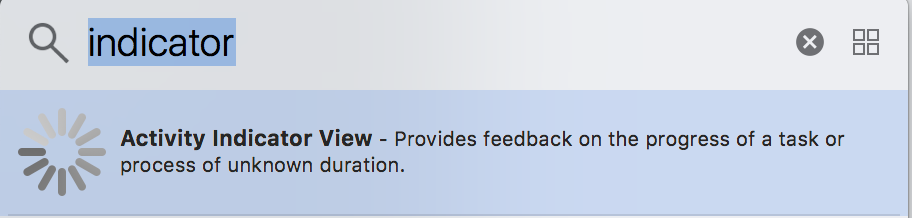

# Activity Indicator

在網頁載入之前加入轉圈  的圖示：

1. `Library`加入  至`Main.storyboard`
2. 服從`WKNavigationDelegate`
3. 有兩個方法需要實作：

```swift
...

    @IBOutlet weak var myActivityIndicator: UIActivityIndicatorView!
      
    // 開始載入網頁  
    func webView(_ webView: WKWebView, didStartProvisionalNavigation navigation: WKNavigation!) {
        myActivityIndicator.startAnimating()
    }
    
    // 網頁載入完成
    func webView(_ webView: WKWebView, didFinish navigation: WKNavigation!) {
        myActivityIndicator.stopAnimating()
    }

...
```

