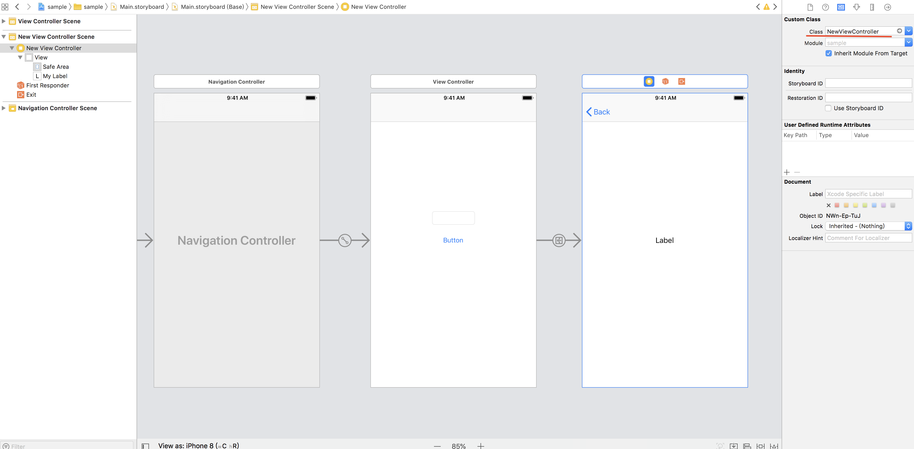
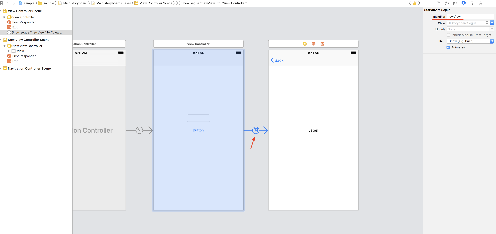

# segue傳值

要使用`segue`傳值到另外的`View Controller`必須先給定好`UIViewController`的子類別（此處為`NewViewController`）及設定`segue`的`Id`（此為`newView`）





```swift
...
    // 使用prepare()將所需的資料傳給別的View Controller，也要注意轉型
    override func prepare(for segue: UIStoryboardSegue, sender: Any?) {
        if segue.identifier == "newView"{
            if let newVC = segue.destination as? NewViewController{
                newVC.infoFromViewOne = myTextField.text as? String
            }
        }
    }
    
...
```

