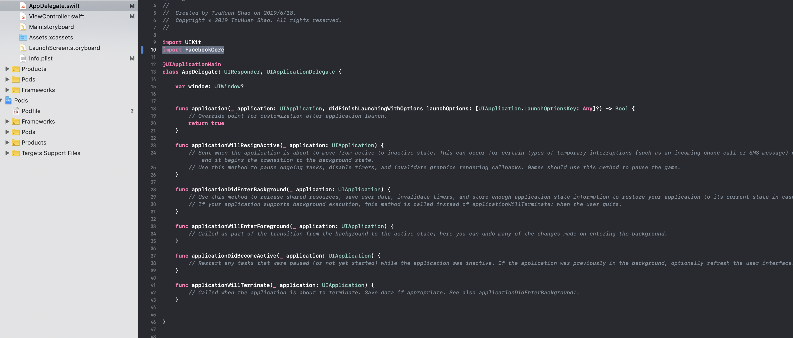

# Facebook SDK for Login

測試環境：  
  - MacOS: 10.14.3  
  - XCode: 10.2.1

1. 須先將APP註冊到[FB的開發者帳戶](https://developers.facebook.com/apps/)，並得到一組**專屬的APP ID**，之後會用到

2. 註冊時記得也要填**Bundle ID**，這邊填跟專案APP的**Bundle Identifier**一致  
 


3. CocoaPods加入  

```text
pod 'FacebookCore'
pod 'FacebookLogin'
pod 'FacebookShare'
```


4. 打開`Info.plist`原始碼\(在`Info.plist`檔按右鍵**Open As** -&gt; **Source Code**\)，並在`<dict>...<\dict>`中加入以下程式碼

```markup
<key>CFBundleURLTypes</key>
<array>
  <dict>
    <key>CFBundleURLSchemes</key>
    <array>
      <string>fb{your-app-id}</string>    #####(包含)大括號中填入專屬的APP ID
    </array>
  </dict>
</array>
<key>FacebookAppID</key>
<string>{your-app-id}</string>    #####(包含)大括號中填入專屬的APP ID
<key>FacebookDisplayName</key>
<string>{your-app-name}</string>  #####(包含)大括號中填入APP的名稱
<key>LSApplicationQueriesSchemes</key>
<array>
  <string>fbapi</string>
  <string>fb-messenger-share-api</string>
  <string>fbauth2</string>
  <string>fbshareextension</string>
</array>
  
```


5. `AppDelegate.swift`要`import FacebookCore` 



6. VC加入以下程式碼就大功告成

```swift
    import FacebookLogin
    
    let loginButton = LoginButton(readPermissions: [ .publicProfile ])
    loginButton.center = view.center

    view.addSubview(loginButton)
```


7. 結果呈現


參考：




