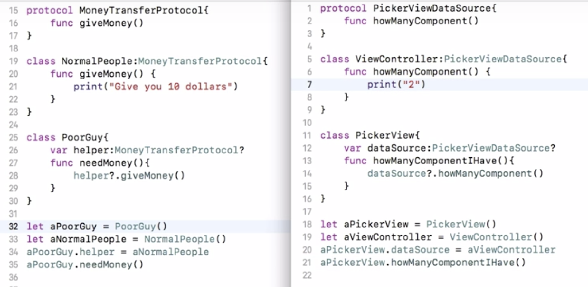

# Protocol

<table>
  <thead>
    <tr>
      <th style="text-align:center"><b>Protocol</b>
      </th>
      <th style="text-align:center"><b>Class</b>
      </th>
    </tr>
  </thead>
  <tbody>
    <tr>
      <td style="text-align:center">
        <p>&#x591A;&#x91CD;&#x7E7C;&#x627F;</p>
        <p>(&#x53EF;&#x4EE5;&#x670D;&#x5F9E;&#x591A;&#x500B;Protocol)</p>
      </td>
      <td style="text-align:center">
        <p>&#x55AE;&#x4E00;&#x7E7C;&#x627F;</p>
        <p>(&#x53EA;&#x80FD;&#x7E7C;&#x627F;&#x4E00;&#x500B;&#x7236;&#x985E;&#x5225;)</p>
      </td>
    </tr>
    <tr>
      <td style="text-align:center">
        <p>Protocol&#x7684;&#x65B9;&#x6CD5;&#x4FDD;&#x8B49;&#x4E00;&#x5B9A;&#x6703;&#x5BE6;&#x4F5C;</p>
        <p>(&#x65B9;&#x6CD5;&#x7531;&#x9075;&#x5FAA;&#x7684;&#x985E;&#x5225;&#x4F86;&#x5BE6;&#x4F5C;&#xFF0C;&#x82E5;&#x672A;&#x5BE6;&#x4F5C;&#x6703;error&#x63D0;&#x9192;)</p>
      </td>
      <td style="text-align:center">
        <p>&#x5B50;&#x985E;&#x5225;&#x9700;&#x7528;&#x5230;&#x7236;&#x985E;&#x5225;&#x7684;&#x65B9;&#x6CD5;&#x5FC5;&#x9808;override</p>
        <p>(&#x82E5;&#x60F3;&#x63D0;&#x4F9B;&#x5B50;&#x985E;&#x5225;&#x81EA;&#x5DF1;&#x7684;&#x65B9;&#x6CD5;&#x537B;&#x672A;&#x5BE6;&#x4F5C;&#x4E0D;&#x6703;error&#x63D0;&#x9192;)</p>
      </td>
    </tr>
  </tbody>
</table>

### **Class範例**

1. 子類別`Batman`繼承父類別`Man`
2. 子類別`Superman`繼承父類別`Man`

```swift
class Man{
    var health:Int
    init(){
        health = 10
    }
    func getHurt(){
        health -= 10
    }
}
class Batman:Man{
    override init(){
		super.init()
		health = 1000
    }
    override func getHurt() {
        health -= 5
    }
    func attack() {
        print("attack with fist")
    }
}
class Superman:Man{
    override init(){
        super.init()
        health = 10000
    }
    override func getHurt() {
        health -= 1
    }
    func attack(target:Hurtable) {
        print("attack with eye laser")
    }
}
```

### Protocol範例

1. 類別`Man`服從`MankindType`與`Hurtable`這兩個Protocol
2. 類別`Batman`服從`MankindType`、`Hurtable`與`Attackable`這三個Protocol
3. 類別`Superman`服從`MankindType`、`Hurtable`與`Attackable`這三個Protocol

```swift
protocol MankindType{
    var health:Int{ get set }
}
protocol Attackable{
    func attack(target:Hurtable)
}
protocol Hurtable:MankindType{
    func getHurt()
}
class Man:MankindType,Hurtable{
    var health:Int
    init(){
        health = 10
    }
    func getHurt(){
        health -= 10
    }
}
class Batman:MankindType, Attackable, Hurtable{
    var health:Int
    init(){
        health = 1000
    }
    func getHurt() {
        health -= 5
    }
    func attack(target:Hurtable) {
        target.getHurt()
    }
}
class Superman:MankindType,Attackable,Hurtable{
    var health:Int
    init(){   
        health = 10000
    }
    func getHurt() {
        health -= 1
    }
    func attack(target:Hurtable) {
        target.getHurt()
    }
}
```

### 窮人與有錢人的protocol範例示意：



### 另一個**protocol**範例示意：

分作三部分：需求者\(房客\)、實作者\(房東\)、協定\(房租\)

1. A房東`LandlordA`、B房東`LandlordB`，各自遵從房租合約的協定`RentContract`，所以他們有不同的租金`rental()`需要實作
2. 房客`Tenant`有租屋需求，所以會宣告一個協定\(房租\)的物件`var delegate: RentContract?`，找到適合自己租金的房子`aLandlordA`或`aLandlordB`，來當作自己的`delegate`

```swift
protocol RentContract {
    func rental()
}

class LandlordA: RentContract {
    func rental() {
        print("Pay 3000 per month with small suite")
    }
}

class LandlordB: RentContract {
    func rental() {
        print("Pay 8000 per month with large suite")
    }
}

// Tenant是RentContract的需求者。意思是，房客有租屋的需求，所以要找負擔得起的房租
// 所以哪個房東的租金適合自己，就拿來當作自己的delegate
class Tenant {
    var delegate: RentContract?
    func rentToPay() {
        delegate?.rental()
    }
}

let aLandlordA      = LandlordA()
let aTenant         = Tenant()
aTenant.delegate    = aLandlordA
aTenant.rentToPay()
```

