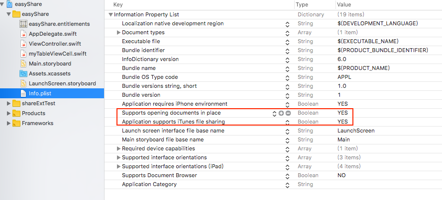
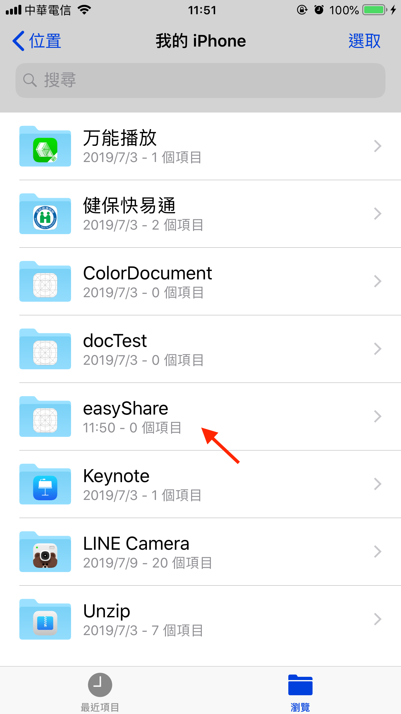
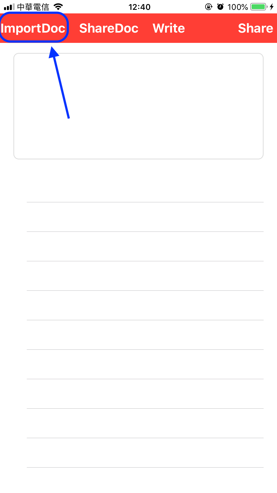
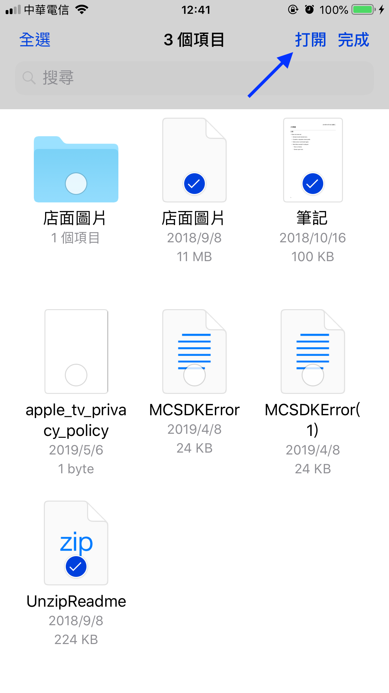
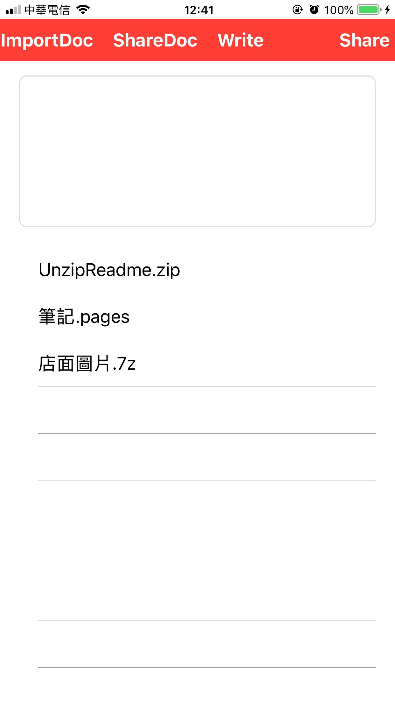

# Files App：關於Import files

## 前言

在iOS11以前，APP之間的檔案系統是獨立的，無法互通，而且也會造成使用者在瀏覽檔案的困擾。在iOS11之後，蘋果加入了一個可以管理手機內部所有檔案的內建App：**Files（檔案）**

使用類別：

* ****`UIDocument`：所有檔案都會繼承該類別，透過該類別來管理所有檔案
* `UIDocumentBrowserViewController`：瀏覽檔案
* `UIDocumentPickerViewController`：取得檔案

### 蘋果提供統一型別的規範：UTI

因應檔案類型在不同環境可能會有不同名稱，像`.jpg`、`.jpeg`、`JPEG`、`image/jpeg`，這些檔其實都屬於同一種類型，蘋果就把這些檔案歸納為`public.jpeg`型別，這是一種**UTI**型別，也就是APPLE為了方便統一管理所有檔案，制定了**UTI \(Uniform Type Identifiers\)**型別，讓自己所有APPLE的裝置都能夠方便相互存取



### 取得檔案的UTI型別

我們應該都知道`.jpg`、`.jpeg`、`JPEG`等這些格式都屬於UTI型別的`Public.jpeg`，但若我們不知道某檔案的UTI型別時該怎麼辦呢？像是`.plist`檔是屬於何種型別該怎麼判別？

#### 方法

在指令列輸入 `mdls -name kMDItemContentType 你的檔案`，回傳結果就是UTI型別



在XCode底下若要使用`kUTTypeXXXX`，必須要`import MobileCoreServices`才能取得

### `UIDocumentBrowserViewController`

`UIDocumentBrowserViewController`是一種型別，就像整數`Int`，布林值`Bool`，文字檔`txt`，而它代表的意義是一個App的類型。比方說，我想要我自己開發的App能夠被其他App瀏覽的話，就必須實作該類別，來定義自己的APP屬於什麼格式的檔案型別

### `UIDocumentPickerViewController`

允許APP使用`UIDocumentPickerViewController`類別來取得裝置內部的所有檔案，並會將選擇的檔案匯入到此APP中，這也代表該資料會被複製一份，而原始檔則確保不會被更動到  


## Files App的Import files

首先，必須先開啟支援`Document`的權限：



開啟權限之後，開啟「**檔案**」App就看得到自己的project name了（我的是：easyShare）




### 測試：檢查App有沒有存在寫入的檔

以下示範如何把`text.txt`文字檔寫到自己的App裡：

```swift
@IBAction func writeFiles(_ sender: Any) {
        
    let file = "\text.txt"
    let contents = "Hello world!"
        
    let dir = FileManager.default.urls(for: .documentDirectory, in: .userDomainMask).first!
    let fileURL = dir.appendingPathComponent(file)
        
    do {
        try contents.write(to: fileURL, atomically: false, encoding: .utf8)
    }
    catch {
        print("Error: \(error)")
    }
}
```


開啟「**檔案**」App，可看到剛剛寫入的檔已經被寫入了


### 如何透過Files App匯入檔案

要開啟類似檔案總管的畫面，就要先建立`UIDocumentPickerViewController`實體，並呼叫`present`方法來產生畫面

```swift
@IBAction func importDocBtn(_ sender: Any) {

    // documentTypes: [填入你想要找的UTI型別]
    let documentPicker = UIDocumentPickerViewController(documentTypes: [kUTTypeItem as String], in: .import)

    // 取得documentPicker的控制權
    documentPicker.delegate = self

    // 是否允許一次匯入多個檔案
    documentPicker.allowsMultipleSelection = true

    // 推出顯示檔案畫面
    present(documentPicker, animated: true, completion: nil) 
}
```

```swift
extension ViewController: UIDocumentPickerDelegate {
    func documentPicker(_ controller: UIDocumentPickerViewController, didPickDocumentsAt urls: [URL]) {

         /*---
         // MARK: - Pick single file
         guard let selectedFileUrl = urls.first else {
            return
         }
         
         let dir = FileManager.default.urls(for: .documentDirectory, in: .userDomainMask).first!
         let sandboxFileUrl = dir.appendingPathComponent(selectedFileUrl.lastPathComponent)
         
         if FileManager.default.fileExists(atPath: sandboxFileUrl.path) {
            print("Already exist!")
         } else {
             do {
                 try FileManager.default.copyItem(at: selectedFileUrl, to: sandboxFileUrl)
                 print("Copy file!")
             } catch {
                 print("error: ", error)
         }
         // MARK END
         ---*/
        
        
        // MARK: - Pick multi files

        // 紀錄匯入檔案是否重複的數量
        var copyCnt = 0
        var notCopyCnt = 0
        
        // dir: 取得sandbox Documents資料夾路徑(Ex: file:///var/.../Documents/)
        let dir = FileManager.default.urls(for: .documentDirectory, in: .userDomainMask).first!
        
        print("")
        
        // 取得每一個所選取來源檔案的路徑(Ex: file:///private/var/.../1.png)
        for (_, url) in urls.enumerated() {

            print("")
            
            // sandboxFileUrl: 取得把檔案加到sandbox Documents之下的路徑(Ex: file:///var/.../Documents/1.png)
            // url.lastPathComponent: 取得檔案名稱(EX: 1.png)
            let sandboxFileUrl = dir.appendingPathComponent(url.lastPathComponent)
            
            // sandboxFileUrl.path: 取得沒有前綴file:///的路徑(Ex: var/.../Documents/1.png)
            if FileManager.default.fileExists(atPath: sandboxFileUrl.path) {
                print("@Already exist: \(url.lastPathComponent)")
                notCopyCnt += 1
                
            } else {
                do {
                    try FileManager.default.copyItem(at: url, to: sandboxFileUrl)
                    print("@Copy file: \(url.lastPathComponent)")
                    copyCnt += 1
                    documentFiles.append(DocumentFile(name: url.lastPathComponent, fileUrl: sandboxFileUrl))
                    
                } catch {
                    print("@error: ", error)
                    return
                }
            }
            print("")
        }
        // MARK END
        
        myTableView.reloadData()
        print(message: "copy: \(copyCnt), not copy: \(notCopyCnt)")
        
}
```









