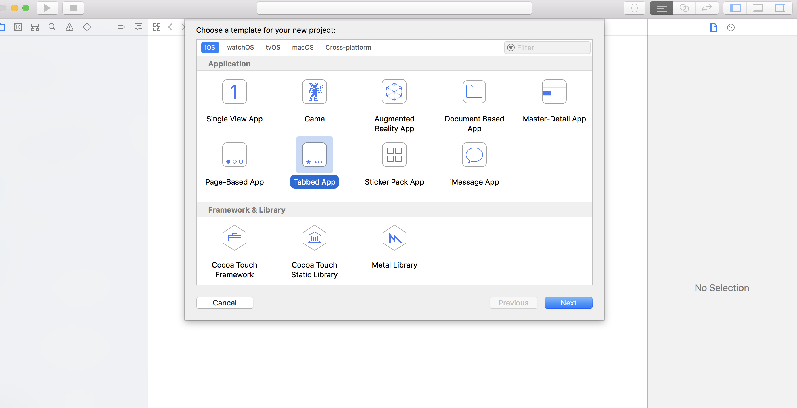
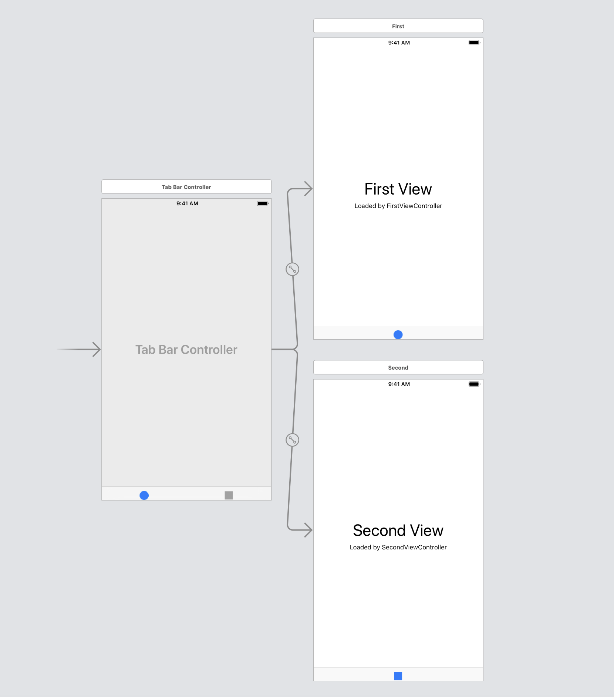
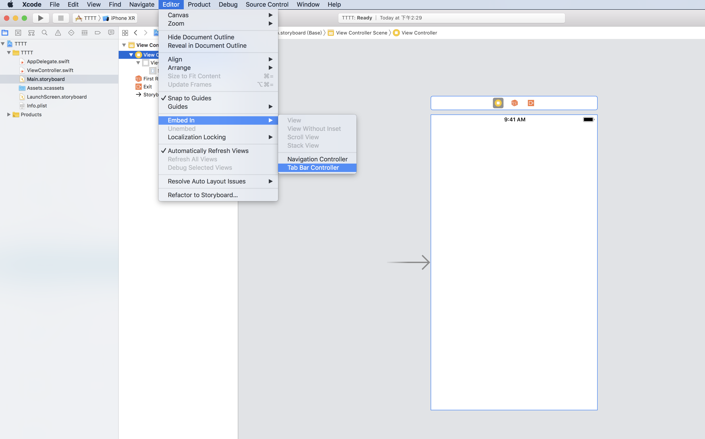
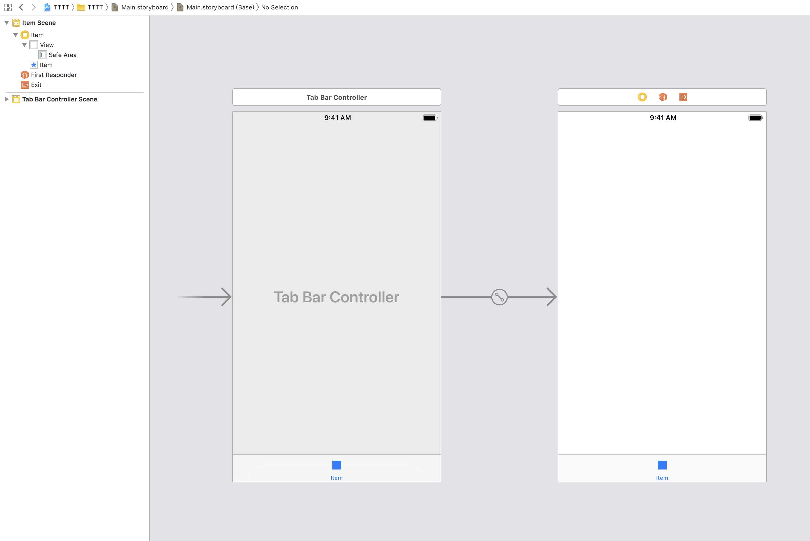

# Tabbed Application \(Tab Bar Controller\)


Tabbed Application?

多畫面的應用程式頁面


建立Tab bar應用程式有兩種方法，如下：

## 第一種方法

建立專案時選擇**Tabbed App**

## 第二種方法

建立**Single View App** 

點選  &gt; **Editor**&gt; **Embed In** &gt; **Tab Bar Controller**

\*\*\*\*

若要新增更多個頁面，**Library**&gt; 加入**View Controller** ，再將**Tab Bar Controller**連結到新加入的**View Controller**

