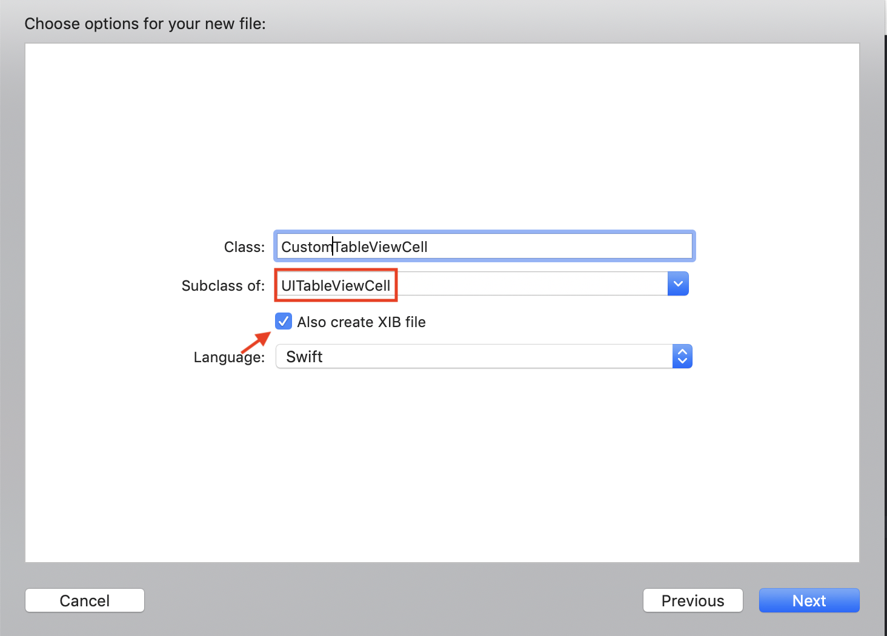
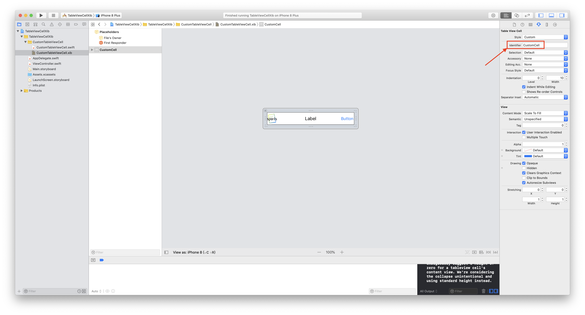
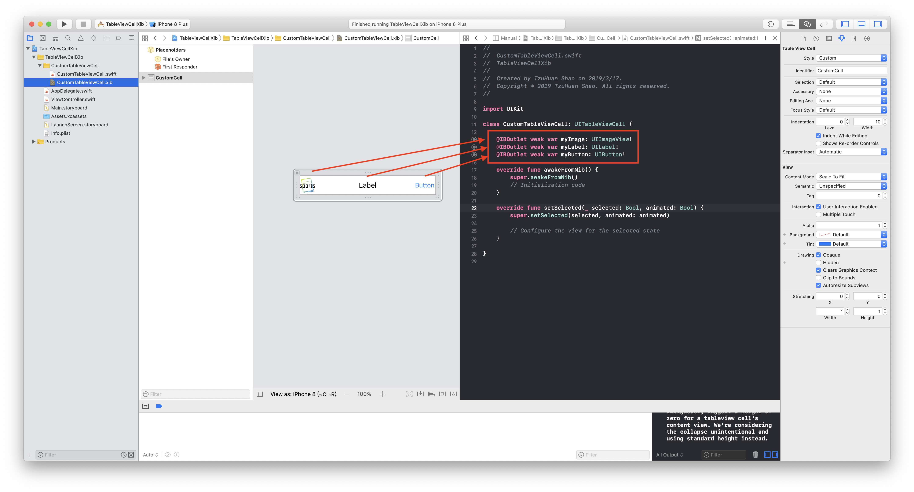
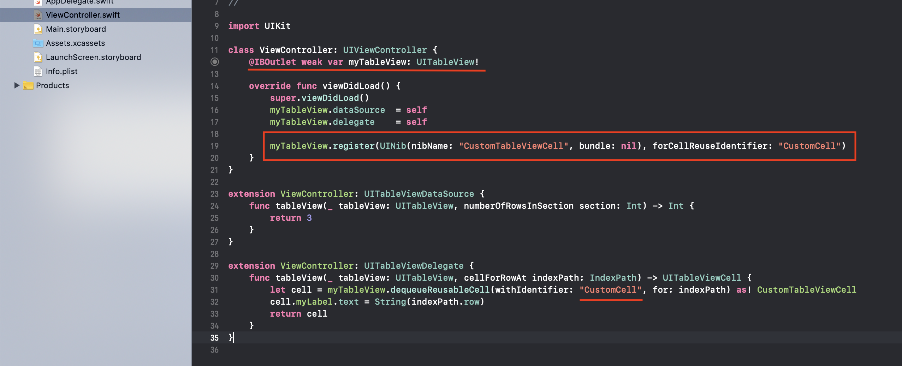
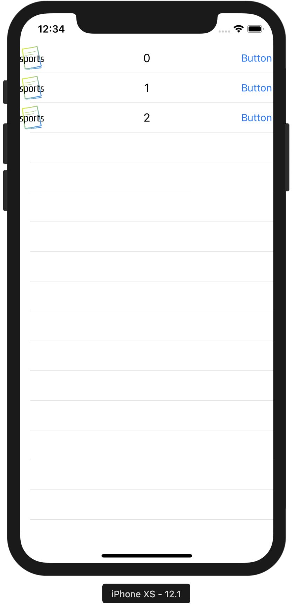

# 客製化TableViewCell









```swift
// nibName: 要客製化cell的檔案名稱, CustomTableViewCell.xib
// forCellReuseIdentifier: 要客製化cell的ID
myTableView.register(UINib(nibName: "CustomTableViewCell", bundle: nil), forCellReuseIdentifier: "CustomCell")
...

// withIdentifier: 要客製化cell的ID
let cell = myTableView.dequeueReusableCell(withIdentifier: "CustomCell", for: indexPath) as! CustomTableViewCell

```





