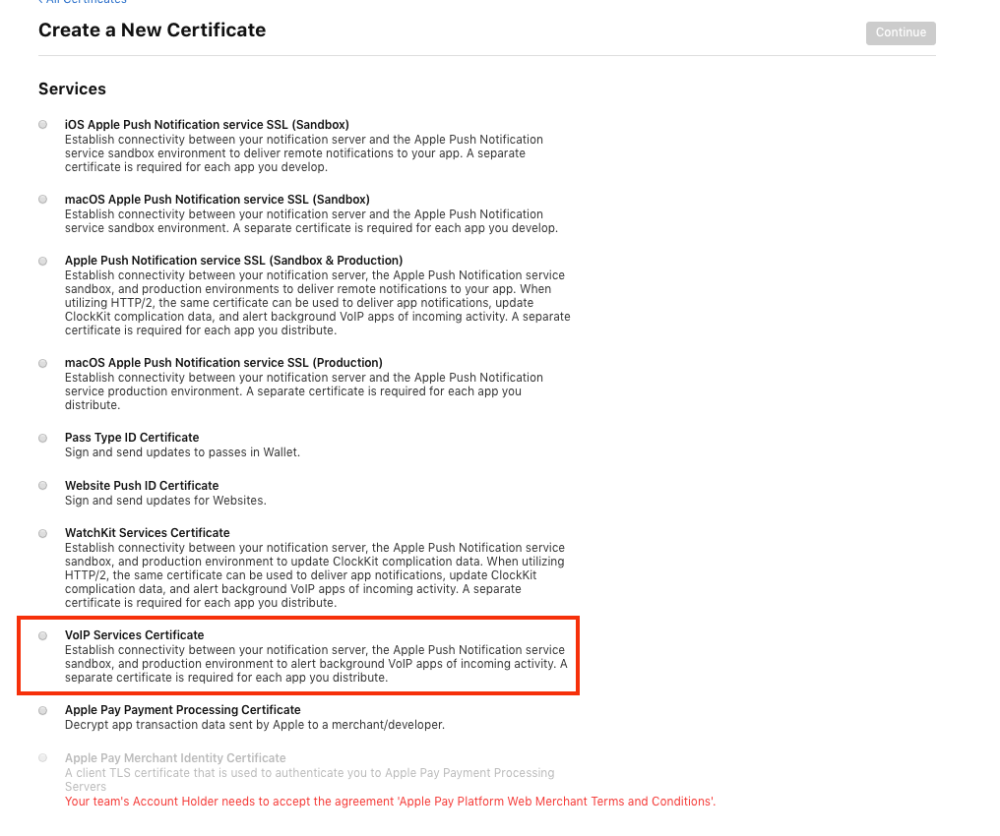

# Push Notification與PushKit

## 本地通知 Push Notification \(Local\)

### 範例1



### 範例2




## 遠端通知 Push Notification \(Remote\)

### 範例



### 遠端通知與Silent Push



### Silent Push需注意的地方



經實測，接著線的時候，傳送`payload`給APN時，device能夠即時地收到回應，也正是我們期待的行為。

但若不接線時，傳送`payload`給APN，雖然的確能夠收到回應，但device不一定是即時地接收到回應，也有可能在幾小時後才收到，且也不保證每一則都能確實收到。會有如此問題是因為蘋果似乎不允許在短時間大量傳送訊息。

因為無法保證即時性與資料完整性的要求，因此再試另一種通知的方法：**PushKit**

## **PushKit**

基本上PushKit的環境配置與程式碼註冊的流程，與前一個**遠端通知**的方法幾乎相同，差別只在於建立憑證的方式，PushKit只要選擇VoIP就可以，並不用再分為開發憑證與生產憑證兩種。




收到通知要做什麼事，在**遠端通知**是由以下函式處理：

```swift
func application(_ application: UIApplication, didReceiveRemoteNotification userInfo: [AnyHashable : Any], fetchCompletionHandler completionHandler: @escaping (UIBackgroundFetchResult) -> Void) {
    ...
}
```

相對於PushKit，則是由`PKPushRegistryDelegate`當中的函式處理：

```swift
func pushRegistry(_ registry: PKPushRegistry, didReceiveIncomingPushWith payload: PKPushPayload, for type: PKPushType) {
    ...
}
```

### 範例



```swift
import UIKit
import UserNotifications
import PushKit

@UIApplicationMain
class AppDelegate: UIResponder, UIApplicationDelegate {
    var window: UIWindow?
    var voipRegistry: PKPushRegistry!
    
    func application(_ application: UIApplication, didFinishLaunchingWithOptions launchOptions: [UIApplication.LaunchOptionsKey: Any]?) -> Bool {
        self.registerForVoIPPushes() // 註冊
        
        return true
    }
    
    ...
    
    func registerForVoIPPushes() {
        self.voipRegistry = PKPushRegistry(queue: nil)
        self.voipRegistry.delegate = self as! PKPushRegistryDelegate
        self.voipRegistry.desiredPushTypes = [.voIP]
    }
}

extension AppDelegate: PKPushRegistryDelegate {
    
    // 註冊成功取得token
    func pushRegistry(_ registry: PKPushRegistry, didUpdate pushCredentials: PKPushCredentials, for type: PKPushType) {
        let token = pushCredentials.token.map { String(format: "%02.2hhx", $0) }.joined()
        print("voip token: \(token)")
    }
    
    // 收到通知後要做什麼事，
    // 這邊是實作當收到通知後，會在螢幕上方彈出一個通知訊息
    // 函式內容主要在解析收到的payload，像title文字為何、要不要顯示badge、要不要顯示提示音效等等
    func pushRegistry(_ registry: PKPushRegistry, didReceiveIncomingPushWith payload: PKPushPayload, for type: PKPushType) {
  
        let dic = payload.dictionaryPayload["aps"] as! [AnyHashable : Any]
        
        let theType = UIApplication.shared.currentUserNotificationSettings?.types
        if theType == nil {
            let userNotifySetting = UIUserNotificationSettings(types: [.badge, .sound, .alert], categories: nil)
            UIApplication.shared.registerUserNotificationSettings(userNotifySetting)
        }

        let content = UNMutableNotificationContent()
       
        if let alertDict = dic["alert"] as? [AnyHashable : Any] {
            if let t = alertDict["title"] as? String {
                content.title = t
            }
            if let b = alertDict["body"] as? String {
                content.body = b
            }
        } else if let alertStr = dic["alert"] as? String {
            content.body = alertStr
        }
        
        if let b = dic["badge"] as? NSNumber {
            content.badge = b
        }
        
        if let s = dic["sound"] as? String {
            if (s == "default") { content.sound = UNNotificationSound.default }
        }

        
        let request = UNNotificationRequest(identifier: "notification3", content: content, trigger: nil)
        
        UNUserNotificationCenter.current().add(request, withCompletionHandler: nil)
        
    }
}
```



測試方法我都是使用第三方工具測試：[Easy APNs Provider](https://apps.apple.com/tw/app/easy-apns-provider-push-notification-service-testing-tool/id989622350?mt=12)。跟以下參考連結的測試方法不盡相同。

### Ref.









## 憑證相關

### Ref.

{% embed url="https://medium.com/folllow-em/apns%E6%8E%A8%E6%92%AD%E6%86%91%E8%AD%89%E9%9B%9C%E8%A8%98-d20d9279b9ce" %}


