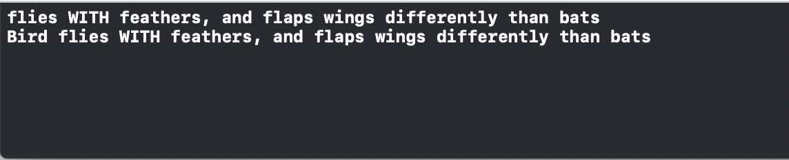

# 如何抓取類別實例的名稱

```swift
protocol ObjectThatFlies
    {
        var flightTerminology: String { get }
        func fly() // no need to provide implementation unless I want
}

extension ObjectThatFlies
{
    func fly() -> Void
    {
        let myType = String(describing: type(of: self))
        let flightTerminologyForType = myType + " " + flightTerminology + "\n"
        print(flightTerminologyForType)
    }
}

class Bird : ObjectThatFlies
{
    var flightTerminology: String = "flies WITH feathers, and flaps wings differently than bats"
}

class Bat : ObjectThatFlies
{
    var flightTerminology: String = "flies WITHOUT feathers, and flaps wings differently than birds"
}

let abird = Bird()
print(abird.flightTerminology)

let bird = Bird()
bird.fly()
```

印出結果：




參考：[https://www.appcoda.com.tw/protocol-oriented-programming/](https://www.appcoda.com.tw/protocol-oriented-programming/)


