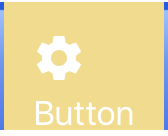
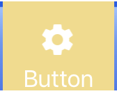

# UIButton圖片在上、文字在下

透過設定`UIButton`自己的屬性`imageEdgeInsets`與`titleEdgeInsets`，讓他們偏移即可完成，透過下面函式來設定：

`UIEdgeInsets(top: CGFloat, left: CGFloat, bottom: CGFloat, right: CGFloat)`

* **`top`**: 正值向下偏移，負值向上偏移
* **`left`**: 正值向右偏移，負值向左偏移
* **`bottom`**: 正值向上偏移，負值向下偏移
* **`right`**: 正值向左偏移，負值向右偏移


圖與程式碼可以相互對應

1.  原始狀態
2.  對`title`偏移之後
3.  對`image`偏移之後

```swift
@IBOutlet weak var testBtn: UIButton!

let imageSize = testBtn.imageView!.bounds.size
let titleSize = testBtn.titleLabel!.bounds.size

// 可以觀察在還沒有移動之前的大小(移動之後大小會隨之而變)
print("testBtn   h:\(testBtn.bounds.height), w:\(testBtn.bounds.width)")
print("imageSize h:\(imageSize.height)     , w:\(imageSize.width)")
print("titleSize h:\(titleSize.height)     , w:\(titleSize.width)")

// 對title偏移
// title向下移動image的高度，再向左移動image的寬度（此時會是與image至左靠齊且在image的下方）
testBtn.titleEdgeInsets = UIEdgeInsets(top: imageSize.height, left: -imageSize.width, bottom: 0, right: 0)

// 對image偏移
// image往右移動title的1/2寬度（此時image會在title的正上方）
testBtn.imageEdgeInsets = UIEdgeInsets(top: 0, left: titleSize.width / 2, bottom: 0, right: 0)
```

