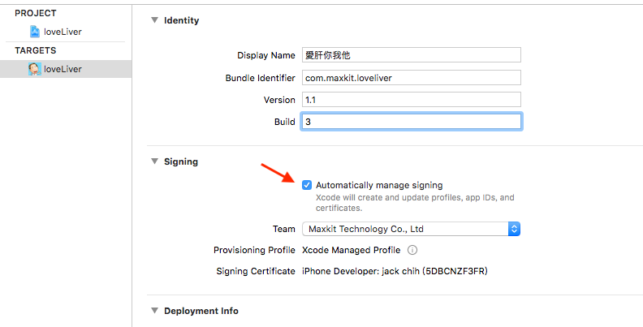
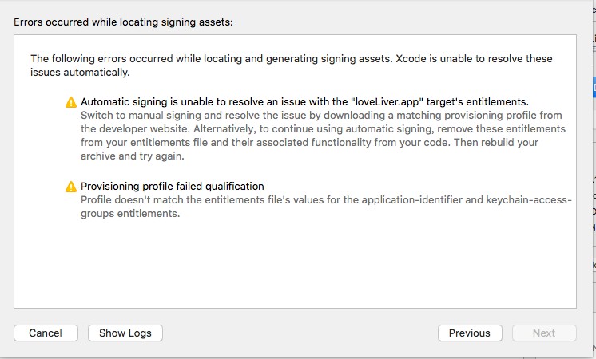
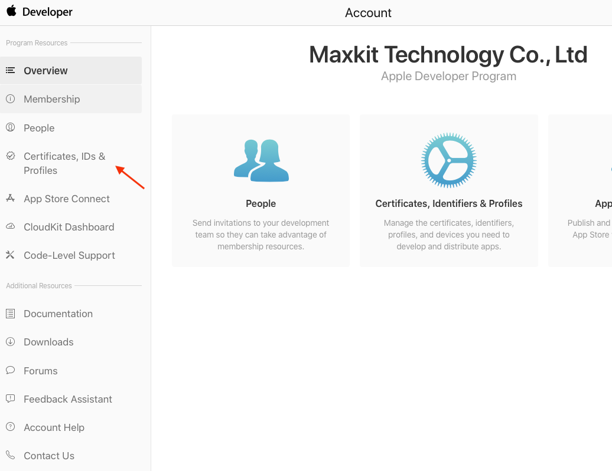
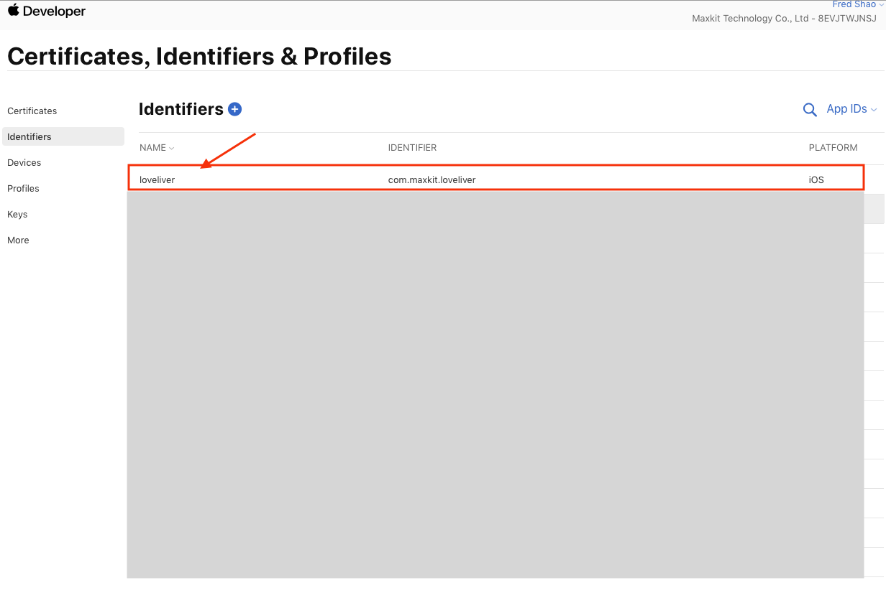
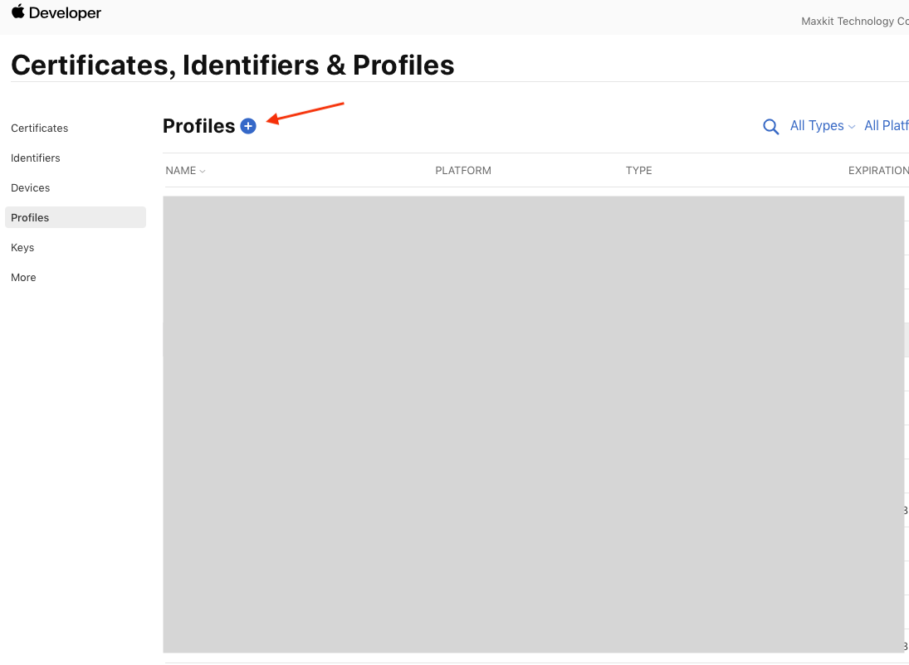
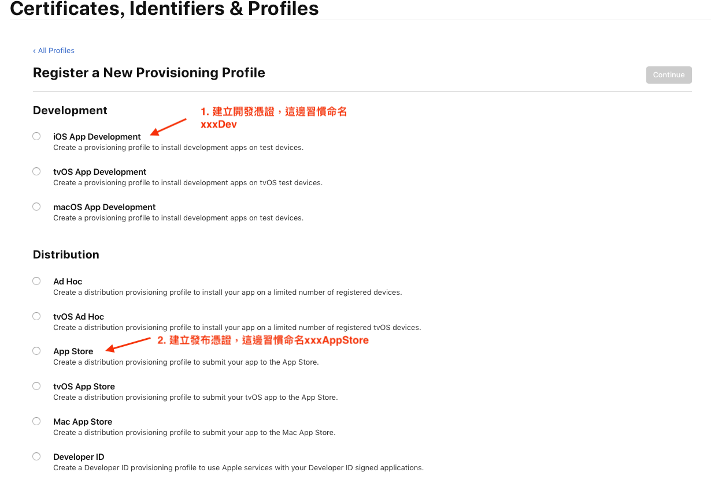
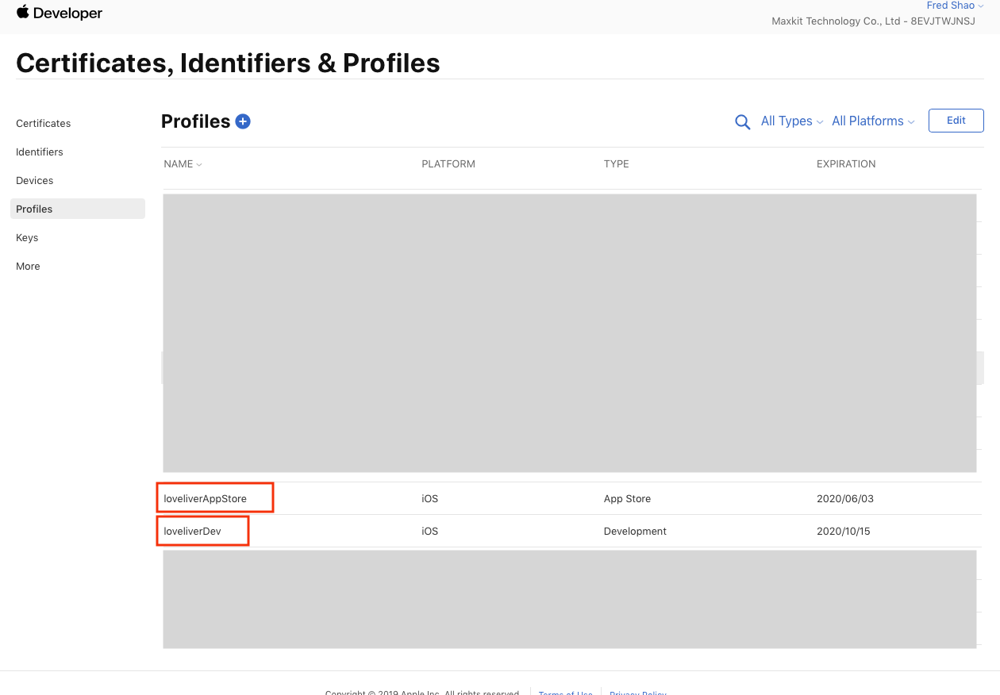
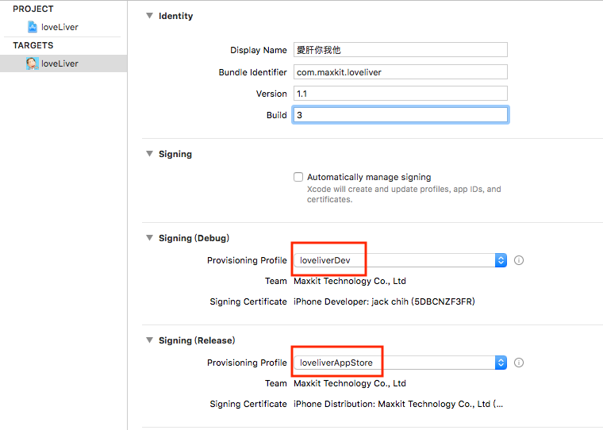

# auto sign無法順利打包

當案子一切就緒準備打包\(Archive\)上架時，使用`Automatically manage singing`時卻遇到下面狀況：

## 解決方法

改由手動建立sign所需要的檔案\(**開發憑證**與**發布憑證**\)

這邊為了方便，直接在圖上標註要新增兩個檔，但實際上這邊一次只能建立一個檔案，所以這裡要操作兩次。

這邊建立完成之後，下載這兩個檔案，下載好之後再分別點擊兩下，XCode會自動去偵測並更新有哪些可用的憑證，此時可以在XCode直接選擇要套用的憑證，之後再重新一次打包流程即可

